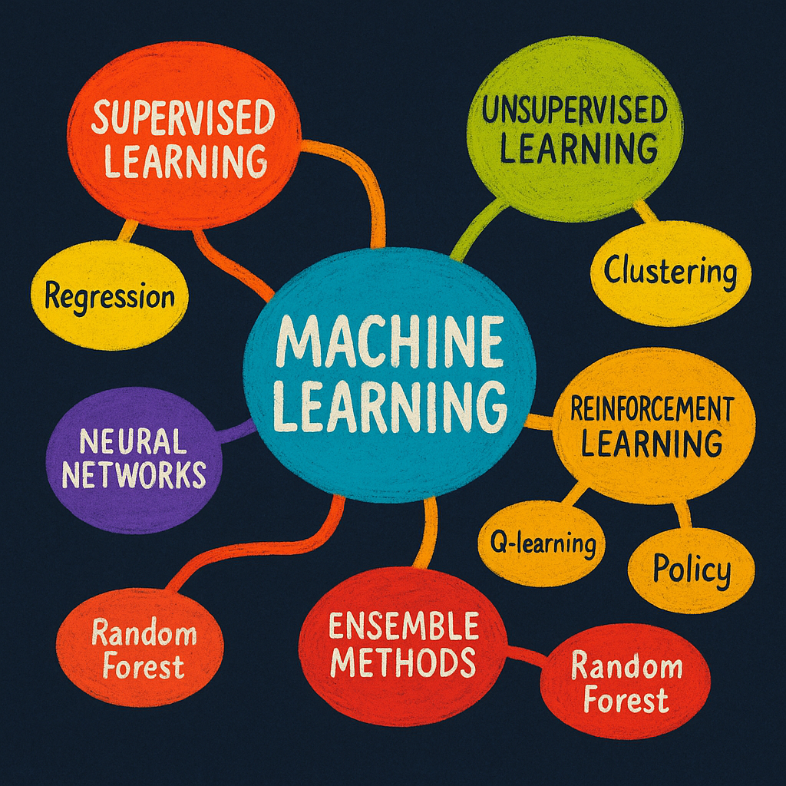

# CMOR438-Spring-2025  
Creator: t0dd26  

  

This repository is the complete code and data for CMOR 438: Machine Learning (Spring 2025). It follows a typical ML project workflow—data organization & exploration, model selection, and model comparison—covering both supervised and unsupervised methods. All examples are hands-on Jupyter notebooks with self-written implementations and scikit-learn demos, using consistent datasets where possible to highlight each algorithm’s behavior.

## Supervised vs Unsupervised  
**Supervised learning** trains on data with known labels. Typical tasks:  
- **Regression** predicts a continuous value (e.g. house price, stock price).  
- **Classification** predicts a discrete category (e.g. spam vs. ham, iris species).

**Unsupervised learning** discovers structure in unlabeled data. Typical tasks:  
- **Clustering** groups similar samples together (e.g. customer segmentation).  
- **Anomaly detection** models “normal” behavior to flag outliers (e.g. fraud detection).

## Regression vs Classification  
- **Regression** fits a function \(y = f(x)\) to minimize a cost (MSE, MAE) and predict continuous labels.  
- **Classification** learns decision boundaries to assign discrete labels; multiclass uses one-hot encoding and cross-entropy loss.  

Learn more:  
- [Supervised learning in scikit-learn](https://scikit-learn.org/stable/supervised_learning.html#supervised-learning)  

## Clustering vs Anomaly Detection  
- **Clustering** partitions data into \(K\) groups when labels are unknown (e.g. K-Means, GMM).  
- **Anomaly detection** fits a normal-data model to flag rare or unusual samples (e.g. Isolation Forest).  

Learn more:  
- [Clustering in scikit-learn](https://scikit-learn.org/stable/modules/clustering.html#clustering)  
- [Outlier detection in scikit-learn](https://scikit-learn.org/stable/modules/outlier_detection.html)  

## Lecture-by-Lecture Notebooks  
All notebooks live in `notebooks/`, data in `data/`, and helper modules in `src/`. Key contents:

1. **Lecture 3 – Perceptron**  
   - `notebooks/Perceptron.ipynb`  
   - `src/single_neuron.py`

2. **Lecture 4 – Linear Regression**  
   - `notebooks/LinearRegression.ipynb`

3. **Lecture 5 – Logistic Regression**  
   - `notebooks/LogisticRegression.ipynb`

4. **Lecture 6 – Deep Neural Networks**  
   - `notebooks/DeepNeuralNetwork.ipynb`

5. **Lecture 7 – k-Nearest Neighbors**  
   - `notebooks/KNN.ipynb`  
   - `notebooks/KNN Regression.ipynb`

6. **Lecture 8 – Decision Trees**  
   - `notebooks/DecisionTreeClassification.ipynb`  
   - `notebooks/DecisionTreeRegression.ipynb`

7. **Lecture 9 – Random Forests & Boosting**  
   - `notebooks/RandomForest.ipynb`  
   - `notebooks/Ensemble_Boosting_Classification.ipynb`  
   - `notebooks/Ensemble_Boosting_Regression.ipynb`

8. **Lecture 10 – Unsupervised Learning**  
   - `notebooks/KMeans_Wine_Clustering.ipynb`  
   - `notebooks/PCA_BreastCancer_Analysis.ipynb`

9. **Lecture 11 – Reinforcement Learning**  
   - `notebooks/RL_Taxi_QLearning.ipynb`

10. **Additional Graph Algorithms**  
    - `notebooks/LabelPropagation_Algorithm.ipynb`  
    - `notebooks/MaxClique_IP.ipynb`

---

## Getting Started

1. **Clone the repo**  
   ```bash
   git clone https://github.com/t0dd26/CMOR438-Spring-2025.git
   cd CMOR438-Spring-2025

2. **Install Dependencies**
    pip install -r requirements.txt
    # or with conda
    conda env create -f environment.yml

3. **Launch Jupyter**
    jupyter lab

Then open any notebook under notebooks/.